# Linux Ağ Yönetimi 2020 Bahar Final Projesi 
# Abdulhamit Kumru 170202020 

\pagebreak

Kullanılan yazılımların versiyonları `Ubuntu Desktop / Server 18`, `Virtual Box 6.1`

### Makinelerin Klonlanması

Base olarak kullanacağımız makineyi oluşturduktan sonra klon makineyi menüden sağ tıklayıp istediğimiz 
şekilde oluşturabiliyoruz. Biz daha az yer kullanmak ve ortak networklere bağlanacağımız için `Linked Clone` 
ve `Generate new MAC addresses for all network adapters` seçeneğini kullanacağız.

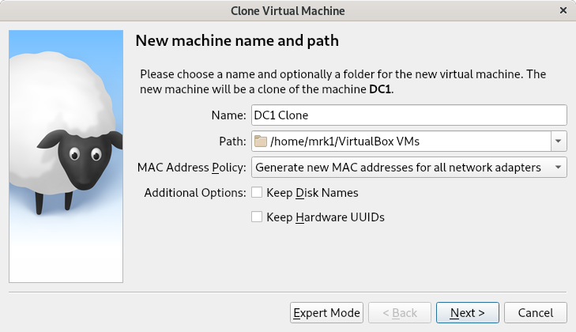{ height=250px }

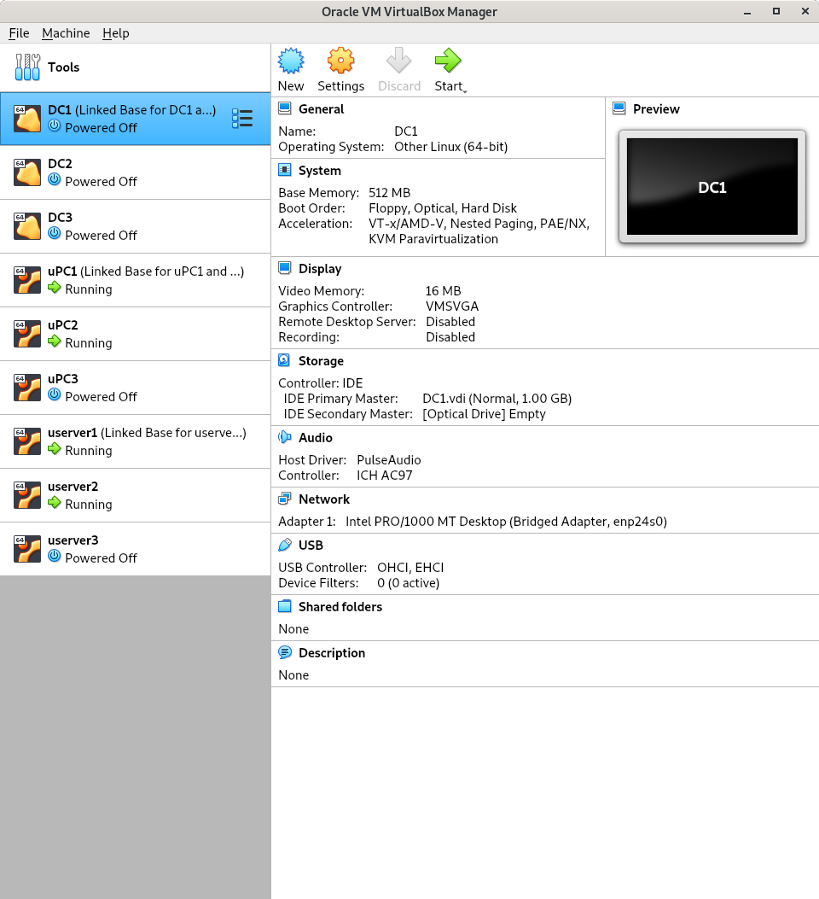{ height=350px }

\pagebreak

## Senaryo 1

### NAT ile Host-Guest Ubuntu PC Bağlantısı 

Başlangıc olarak guest makinenin Network Adapterini NAT olarak seçiyoruz

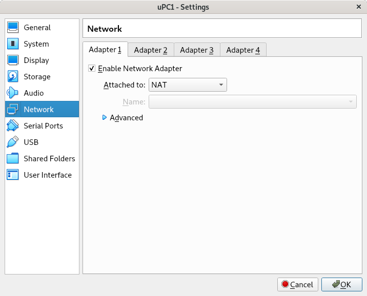{ height=250px }

##### SSH 

host makineye NAT bağlantı ile erişebilmek için öncelikle gerekli gerekli portu yönlendiriyoruz
daha sonra gueste ssh ile bağlanabilmek için open-ssh serveri apt ile yüklüyoruz.

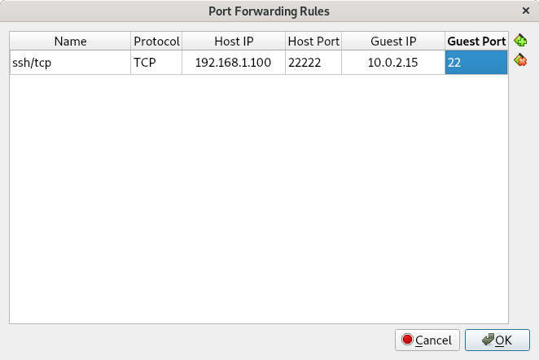{ height=250px }

```bash
$ apt install opessh-server
```

ssh server servisinin ayarlarını  dosyasından 22 numaralı portu ve parolayı kabul edicek
şekilde yapıyoruz.

```bash
$ echo "Port 22" >> /etc/ssh/sshd_config
$ echo "PasswordAuthentication yes" >> /etc/ssh/sshd_config
```

Ayarların aktif olmasi için ssh servisimizi yeniden başlatıyoruz.

```bash
$ sudo service ssh restart
```

Forward ettiğimiz port üzerinden guest'e bağlabiliriz.

```bash
$ ssh kumru@192.168.1.100 -p 22222 # hostun ip adresi
```

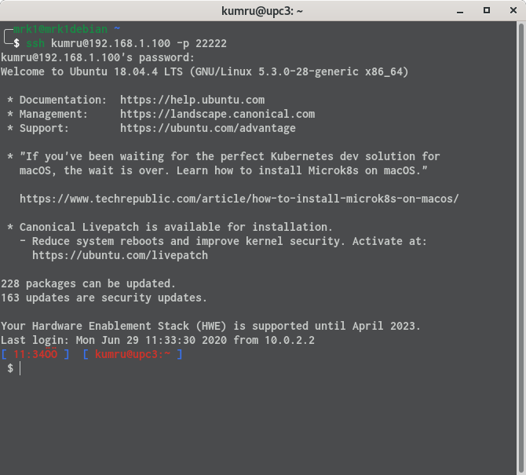{ height=250px }

#### Ping

Eğer ICMP port ile çalışsaydı aynı şekilde onunda portunu yönlendirip gueste ping atabilirdik fakat ICMP
TCP/UDP portları üzerinden çalışmıyor.

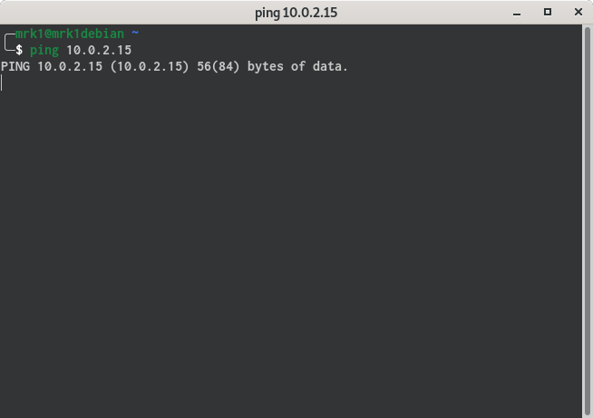{ height=250px }

#### Misafir Eklentileri 

Misafir eklentilerini guest makinye sanal disk takarak yükleyebiliyoruz bu sayade hosttan gueste veya guestten
hosta kopyala yapıştır ve dosya sürekle bırak yapabiliyoruz. Eklentiyi yüklelemek zor değil sanal makine
penceresinden `Devices > Insert Guest Additions CD...` seçeneğini seçince bize autorun.sh'ı çalıştırayım mı
diye soruyor evet diyip parolamızı girince eklentiler yükleniyor

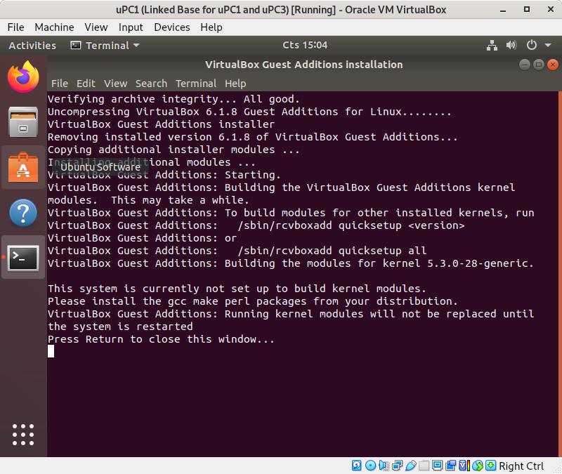{ height=250px }

Sanal makinenin penceresinden  `Devices > Drag and Drop`, `Devices > Shared Clipboard` seçeneklerinden detaylı
ayar yapılabilir.


[gif linki](https://github.com/mrkaurelius/linux_ag_sunum/blob/master/s1/dd.gif)

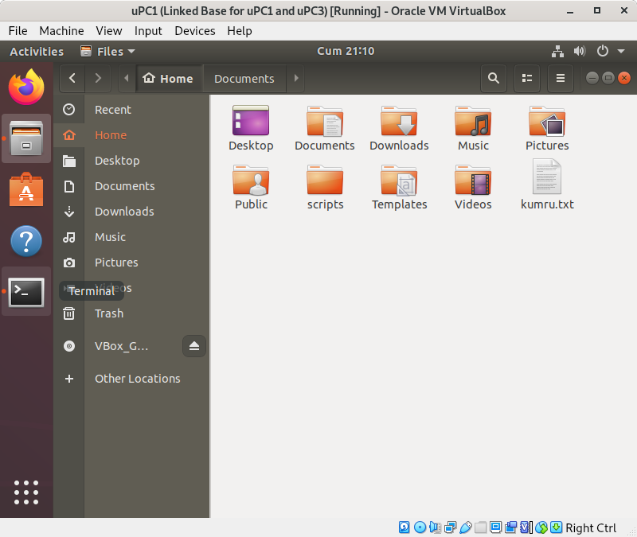{ height=250px }

### Network Bridge ile Host, TinyCore Guest Bağlantısı

Guestin network adapter ayarını Bridge Adapter olarak seçiyoruz

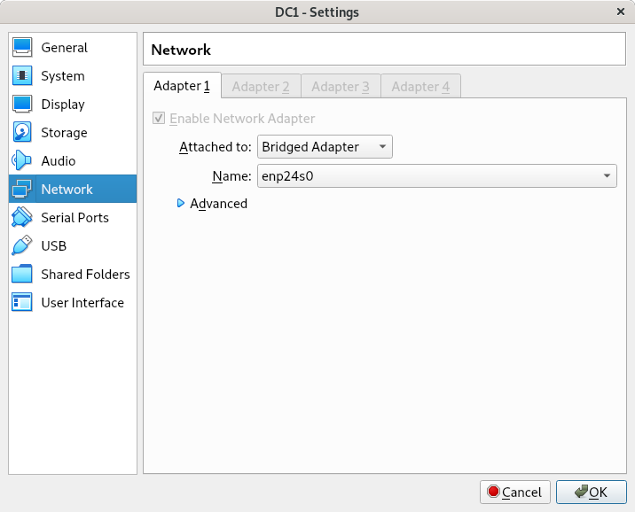{ height=250px }

TinyCoreda IP'mizi ifconfig komutu ile kontol edebiliyoruz.

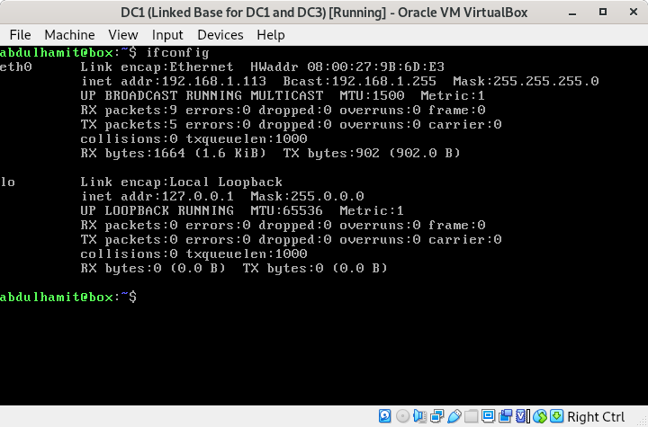{ height=250px }

Network Bridge ile Guest LANdaki makine gibi kullanılabilir.

#### SSH

tce-load programı ile TinyCoreda program yükleyebiliyoruz.

```bash
# openssh client/server paketini yukleme
tce-load -w -i openssh.tcz
# ssh/sshd ayarlari
cp /usr/local/etc/ssh/ssh_config.orig /usr/local/etc/ssh/ssh_config
cp /usr/local/etc/ssh/sshd_config.orig /usr/local/etc/ssh/sshd_config
echo "Port 22" >> /usr/local/etc/ssh/sshd_config
echo "PasswordAuthentication yes" >> /usr/local/etc/ssh/sshd_config
# servisi calistirma
/usr/local/etc/init.d/openssh start
```

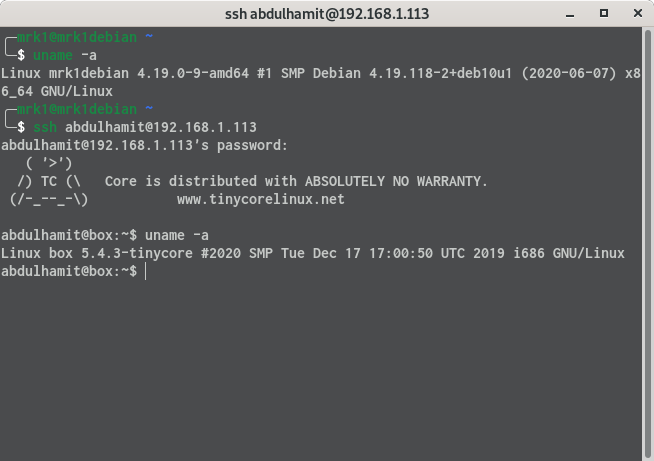{ height=250px }

#### Ping

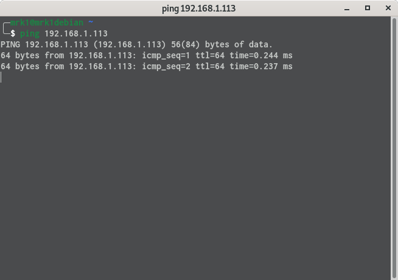{ height=250px }

\pagebreak

### Host only Adapter ile Host, Ubuntu Server Guest Bağlantısı

Host only Adapter kullanabilmek için öncelikle Host Network oluşturmak gerekli. Ana Menüden 
`File > Host Network Manager...`i seçip create tıklıyoruz ve Network Oluşuyor.

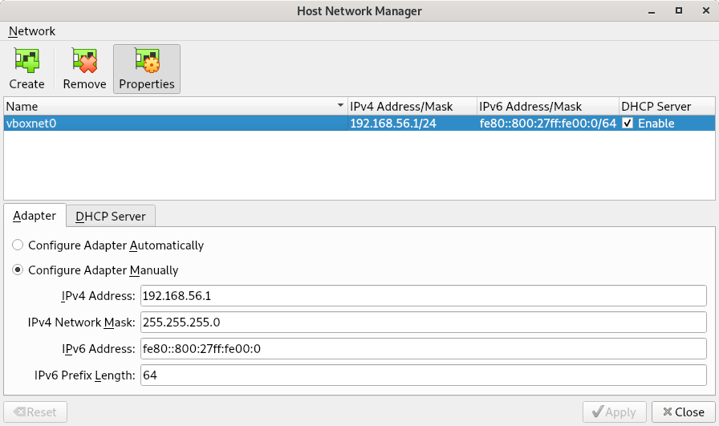{ height=250px }

Guestimizin Network adapterini Host only Adapter seçip alt seçenekten oluşturduğumuz Host Network'ü seçiyoruz.

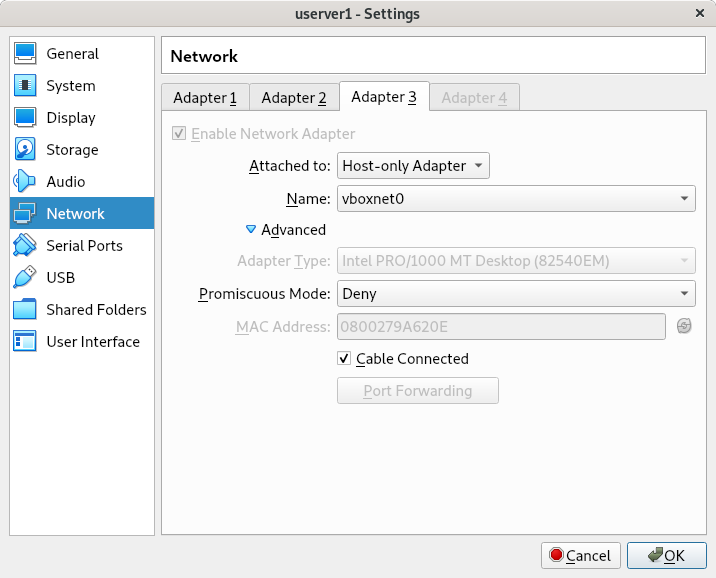{ height=250px }

yaml fromatındaki `/etc/netplan/50-cloud-init.yaml` dosyasını Network Interfacemizi DHCP ile yönetilmesi için
ayarlıyoruz

```yaml
# /etc/netplan/50-cloud-init.yaml
network:
  version: 2
  renderer: networkd
  ethernets:
    enp0s9:
      dhcp4: yes
```

Yeni ayarların kullanması için netplan komutunu çalıştırıyoruz.

```bash
$ sudo netplan --debug apply
```

{ height=250px }

#### SSH

NAT ile Host, Guest Ubuntu PC Bağlantısı bölümünde yaptığımız komutları burada tekrar ediyoruz.

```bash
$ apt install opessh-server
$ echo "Port 22" >> /etc/ssh/sshd_config
$ echo "PasswordAuthentication yes" >> /etc/ssh/sshd_config
$ sudo service ssh restart
```

userver1'e SSH ile bağlanıyoruz.

```bash
$ ssh kumru@192.168.56.101
```

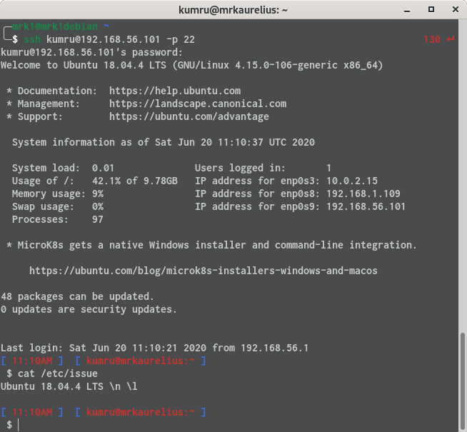{ height=250px }

#### Ping

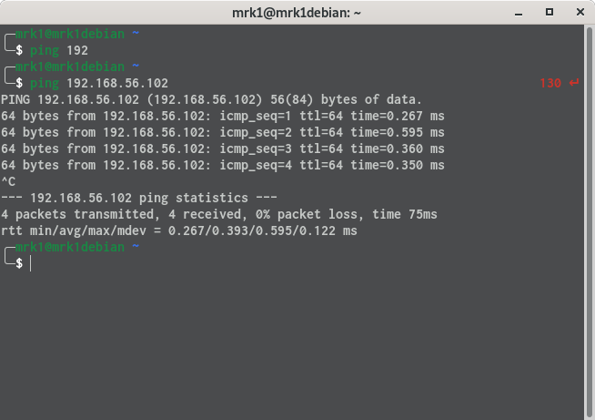{ height=250px }

\pagebreak

## Senaryo 2

#### Internal Network ile Host-Guest, Guest-Guest Bağlatısı

#### Internal Network Ayarı

Senaryo geregi ip Ubuntu Serverlarin ipleri 

`host: 192.168.0.1
userver1: 192.168.0.2
userver2: 192.168.0.3
userver3: 192.168.0.4`

Internal network için Network Adapterin modunu seçmek yeterli.

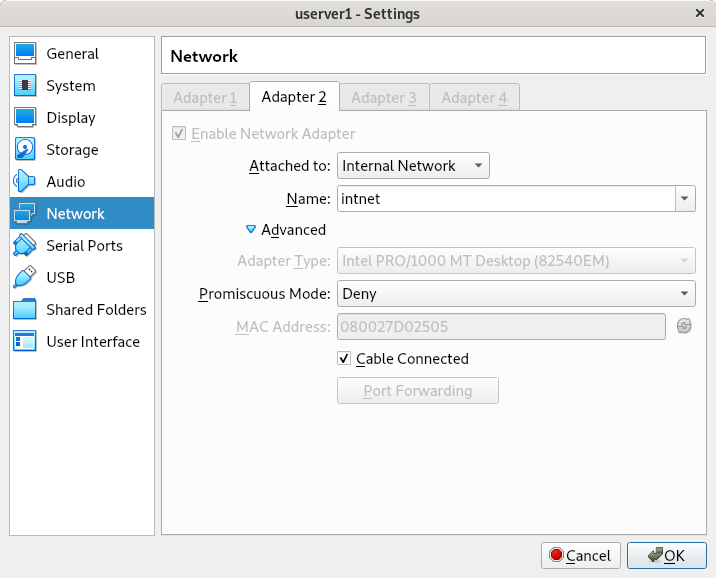{ height=250px }

{ height=250px }

{ height=250px }

{ height=250px }

#### Netplan Ayarları

netplan ayarlarını Senaryo 1 de yaptığımız gibi yapıyoruz. Farklı olarak dhcp olmadan statik bir şekilde IP 
alıyoruz

- userver1
```yaml
# /etc/netplan/50-cloud-init.yaml
# S:0 R:2 userver1
network:
  version: 2
  renderer: networkd
  ethernets:
    enp0s8:
      dhcp4: no
      addresses:
        - 192.168.0.2/24
      gateway4: 192.168.0.1
```

- userver2
```yaml
# /etc/netplan/50-cloud-init.yaml
# S:0 R:2 userver2
network:
  version: 2
  renderer: networkd
  ethernets:
    enp0s8:
      dhcp4: no
      addresses:
        - 192.168.0.3/24
      gateway4: 192.168.0.1
```

- userver3
```yaml
# /etc/netplan/50-cloud-init.yaml
# S:0 R:2 userver3
network:
  version: 2
  renderer: networkd
  ethernets:
    enp0s8:
      dhcp4: no
      addresses:
        - 192.168.0.4/24
      gateway4: 192.168.0.1
```

#### SSH

SSH server yüklediğimiz için ve diğer makineler klon olduğu için bir daha SSH yükleme ve ayarlamaya gerek yok.
Guestler arasında SSH bağlantısı yapılabiliyor.

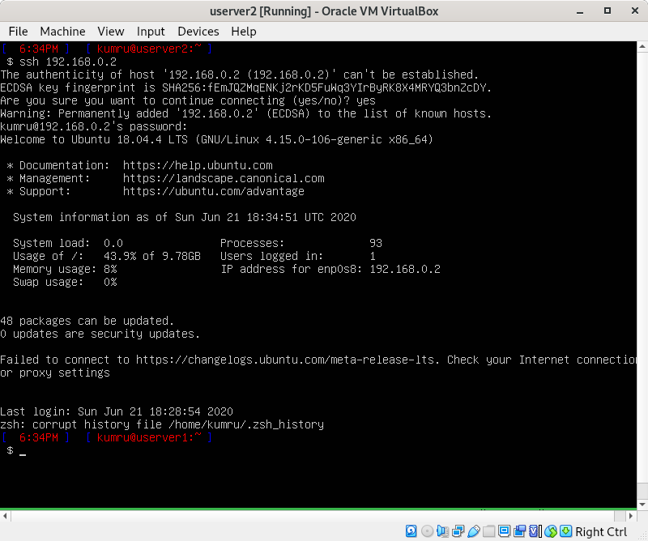{ height=250px }

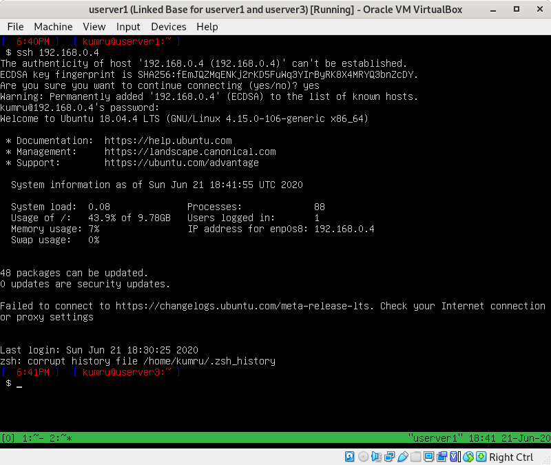{ height=250px }

Internal Networkte hostdan guestlere ulaşmak mümkün değil.

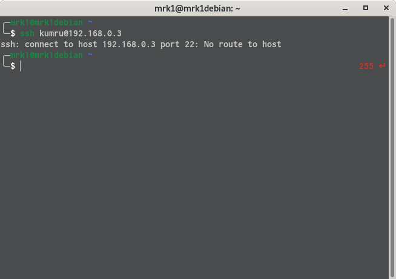{ height=250px }

#### Ping

Guestler birbirlerine ulaşabildiği için birbirlerine ping göndermeleri mümkün.

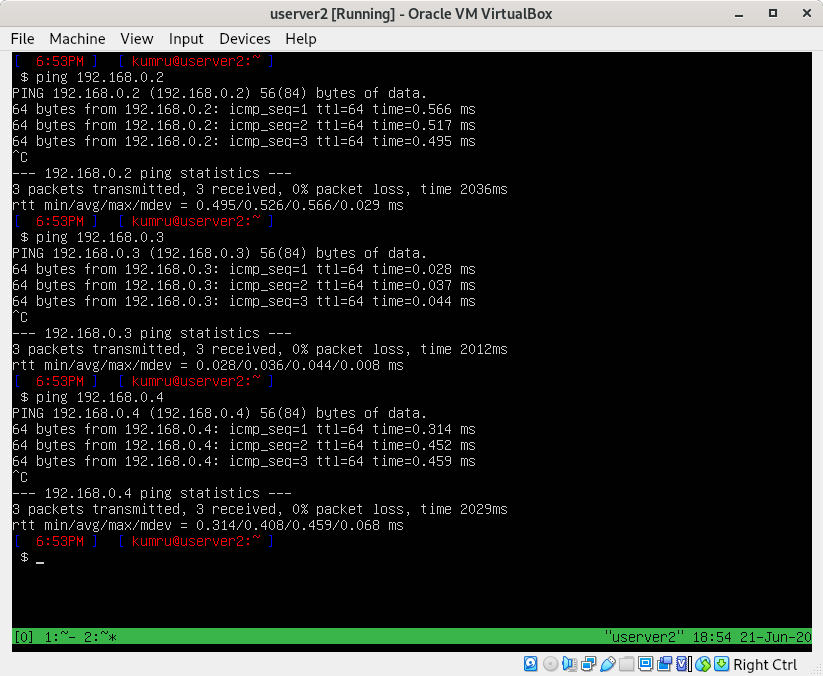{ height=250px }

#### SCP

Gerek olmasada boş dosya göndermek yerine sıfır yazılmış 100M büyüklüğünde dosyalar gönderelim.

```bash
# dosyalari hazirlama
$ dd if=/dev/zero of=abdulhamit.txt count=100 bs=1M
$ cat abdulhamit.txt > kumru.txt > 170202020.txt
# scp komutu
$ scp *.txt 192.168.0.3:/home/kumru/
```

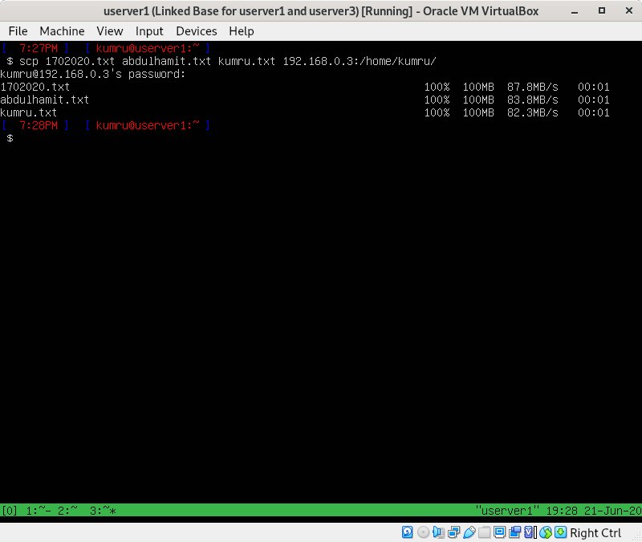{ height=250px }

\pagebreak

## Senaryo 3

Bu senaryoda bir ağdan diğer ağa routing yapmamız istenmekte. Router yazılımı olarak Quaggayı kullanacağız.

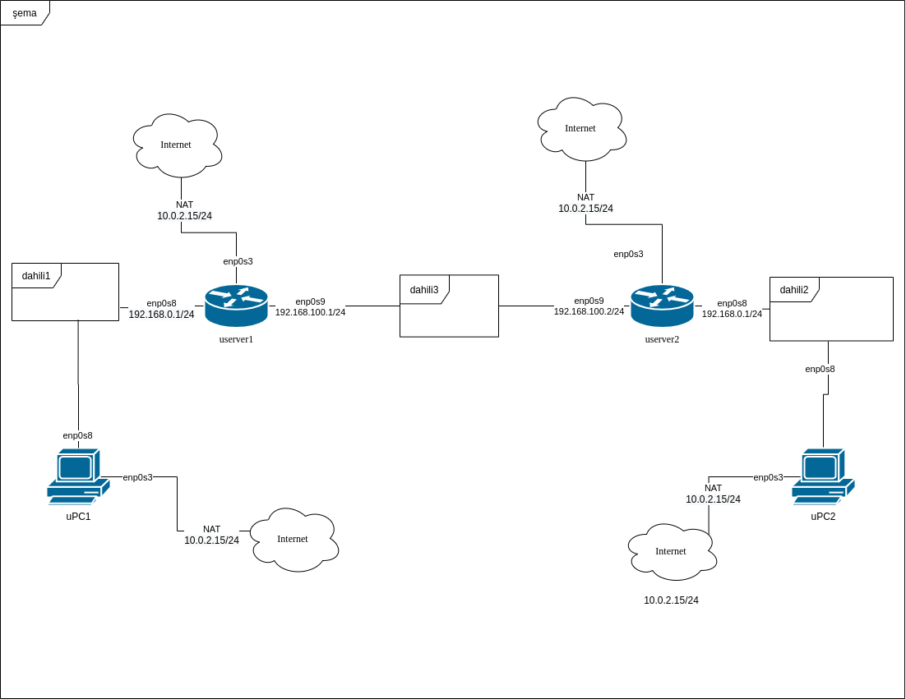{ height=350px }

- dahili1  
`uPC1 192.168.1.1`  
`userver1 192.168.1.254`  
  
- dahili2  
`uPC2 192.168.2.1`  
`userver2 192.168.2.254`  

- dahili 3
`userver1 192.168.100.1`  
`userver2 192.168.100.2`  

### Network Ayarları

#### Virtual Box Network Ayarları

Serverlardaki adapter4 hariç diğer adaptörler senaryo gerekleri için kullandık. Adapter4 ü ise sunucuları 
yönetmek için kullandık.

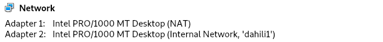{ height=250px }

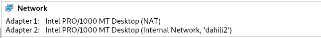{ height=250px }

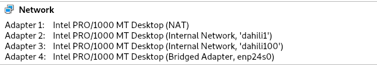{ height=250px }

{ height=250px }

#### PC'lerin netplan Ayarları

uPC1 netplan ayarları
```yaml
# uPC1 
network:
  version: 2
  renderer: networkd
  ethernets: 
    enp0s3:
      dhcp4: yes
    enp0s8:
      dhcp4: no
      addresses:
      - 192.168.1.1/24
      gateway4: 192.168.1.254
      nameservers:
          addresses: [8.8.8.8, 1.1.1.1]
      routes:
      - to: 192.168.0.0/16
        via: 192.168.1.254
```

uPC2 netplan ayarları
```yaml
# uPC2
network:
  version: 2
  renderer: networkd
  ethernets: 
    enp0s3:
      dhcp4: yes
    enp0s8:
      dhcp4: no
      addresses:
        - 192.168.2.1/24
      gateway4: 192.168.2.254
      nameservers:
          addresses: [8.8.8.8, 1.1.1.1]
      routes: 
      - to: 192.168.0.0/16
        via: 192.168.1.254
```

#### Server'lerin Network Ayarları

Serverlerin nat ayarları
```yaml
# serverler için ortak nat ayarı
network:
  ethernets:
    enp0s3:
      dhcp4: true
  version: 2
```

userver2
```yaml
# userver2 
network:
  version: 2
  renderer: networkd
  ethernets:
    enp0s8:
      dhcp4: no
      addresses:
        - 192.168.0.1/24
      #gateway4: 192.168.0.1
      nameservers:
        addresses: [8.8.8.8, 8.8.4.4]
    enp0s9:
      dhcp4: no
      addresses:
        - 192.168.100.2/24
      #gateway4: 192.168.0.1
      nameservers:
        addresses: [8.8.8.8, 8.8.4.4]
    enp0s10:
      dhcp4: no
      addresses:
        - 192.168.1.201/24
      #gateway4: 192.168.0.1
      nameservers:
        addresses: [8.8.8.8, 8.8.4.4]
```

userver1
```yaml
# userver1 
network:
  version: 2
  renderer: networkd
  ethernets:
    enp0s8:
      dhcp4: no
      addresses:
        - 192.168.0.1/24
      #gateway4: 192.168.0.1
      nameservers:
        addresses: [8.8.8.8, 8.8.4.4]
    enp0s9:
      dhcp4: no
      addresses:
        - 192.168.100.1/24
      #gateway4: 192.168.0.1
      nameservers:
        addresses: [8.8.8.8, 8.8.4.4]
    enp0s10:
      dhcp4: no
      addresses:
        - 192.168.1.200/24
      #gateway4: 192.168.0.1
      nameservers:
        addresses: [8.8.8.8, 8.8.4.4]
```

#### Serverlera Quagga Kurulumu ve Ayarları

Buradaki bilgiler [brianlinkletter.com](http://www.brianlinkletter.com/how-to-build-a-network-of-linux-routers-using-quagga/)
, [ixnfo.com](https://ixnfo.com/en/installing-quagga-on-ubuntu-server-18.html) dan alınmıştır.

#### Quagga Kurulum Scripti

```bash 
#!/bin/bash
# quagga installer
if [ "$EUID" -ne 0 ]
  then echo "Please run as root"
  exit
fi

sudo apt install quagga quagga-doc
sudo cat > /etc/quagga/daemons << EOF
zebra=yes
bgpd=no
ospfd=yes
ospf6d=no
ripd=no
ripngd=no
isisd=no
babeld=no
EOF

echo "net.ipv4.ip_forward=1" >> /etc/sysctl.conf
cp /usr/share/doc/quagga-core/examples/vtysh.conf.sample /etc/quagga/vtysh.conf
cp /usr/share/doc/quagga-core/examples/zebra.conf.sample /etc/quagga/zebra.conf
cp /usr/share/doc/quagga-core/examples/bgpd.conf.sample /etc/quagga/bgpd.conf
chown quagga:quagga /etc/quagga/*.conf
chown quagga:quaggavty /etc/quagga/vtysh.conf
chmod 640 /etc/quagga/*.conf
service zebra start
service bgpd start
systemctl enable zebra.service
systemctl enable bgpd.service
echo 'VTYSH_PAGER=more' >>/etc/environment 
echo 'export VTYSH_PAGER=more' >>/etc/bash.bashrc
```

#### Quagga Ayar Scriptleri

- userver1  
```bash
#!/bin/bash
if [ "$EUID" -ne 0 ]
  then echo "Please run as root"
  exit
fi
cat >> /etc/quagga/ospfd.conf << EOF
interface enp0s8
interface enp0s9
interface lo
router ospf
 passive-interface enp0s8
 network 192.168.1.0/24 area 0.0.0.0
 network 192.168.100.0/24 area 0.0.0.0
line vty
EOF
cat >> /etc/quagga/zebra.conf << EOF
interface enp0s8
 ip address 192.168.1.254/24
 ipv6 nd suppress-ra
interface enp0s9
 ip address 192.168.100.1/24
 ipv6 nd suppress-ra
interface lo
ip forwarding
line vty
EOF
sudo service zebra restart
sudo service bgpd restart
```

- userver2  
```bash
#!/bin/bash
if [ "$EUID" -ne 0 ]
  then echo "Please run as root"
  exit
fi
cat >> /etc/quagga/ospfd.conf << EOF
interface enp0s8
interface enp0s9
interface lo
router ospf
 passive-interface enp0s8
 network 192.168.2.0/24 area 0.0.0.0
 network 192.168.100.0/24 area 0.0.0.0
line vty
EOF
cat >> /etc/quagga/zebra.conf << EOF
interface enp0s8
 ip address 192.168.2.254/24
 ipv6 nd suppress-ra
interface enp0s9
 ip address 192.168.100.2/24
 ipv6 nd suppress-ra
interface lo
ip forwarding
line vty
EOF
sudo service zebra restart
sudo service bgpd restart
```

#### Ayar sontrası cihazların durumu

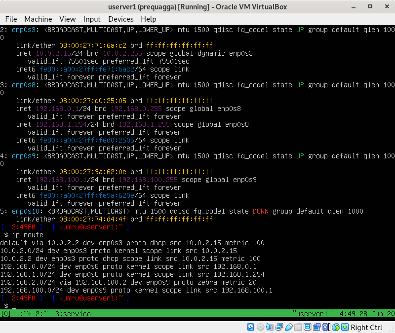{ height=250px }

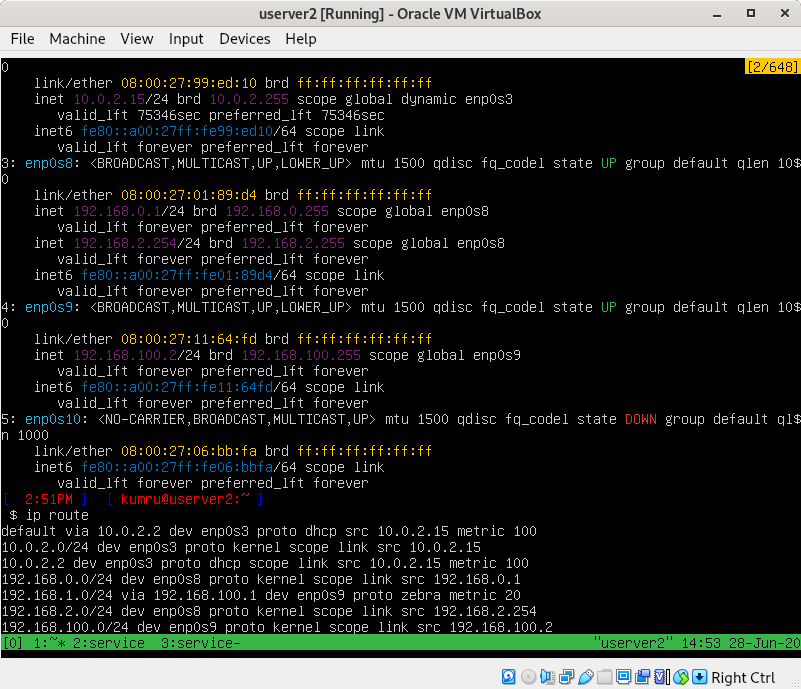{ height=250px }

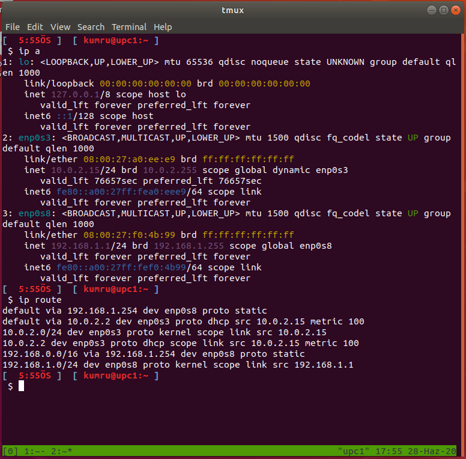{ height=250px }

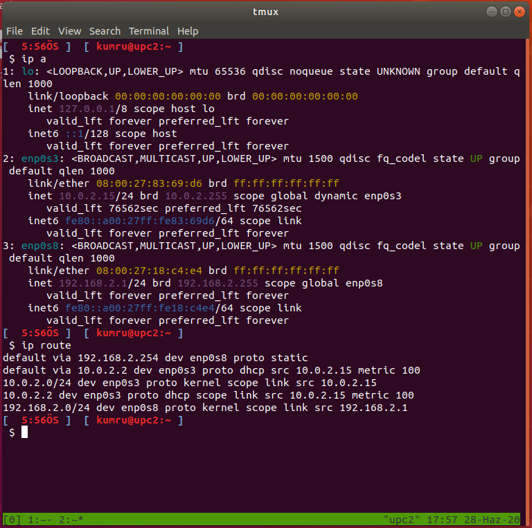{ height=250px }

#### traceroute, paket takibi
Traceroute komutu ile paketlerin izlediği yolun takibini yapabiliriz.

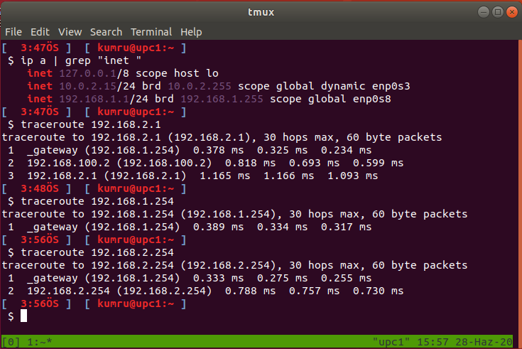{ height=250px }
