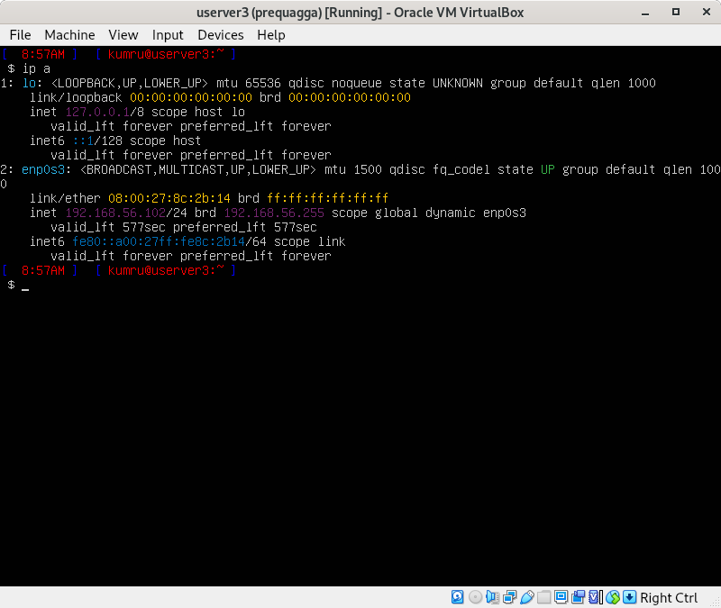
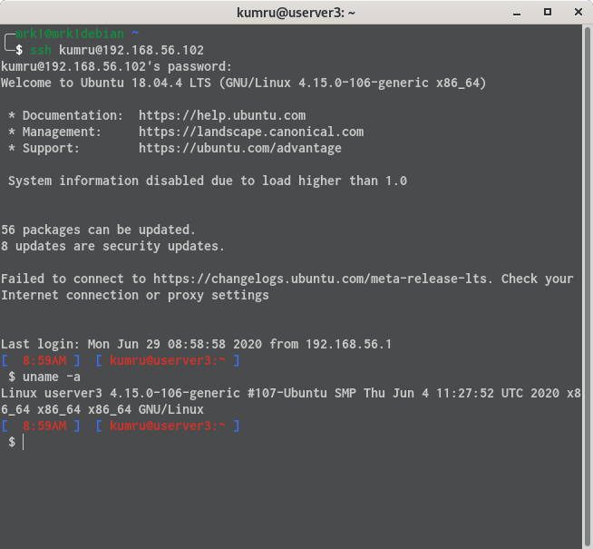
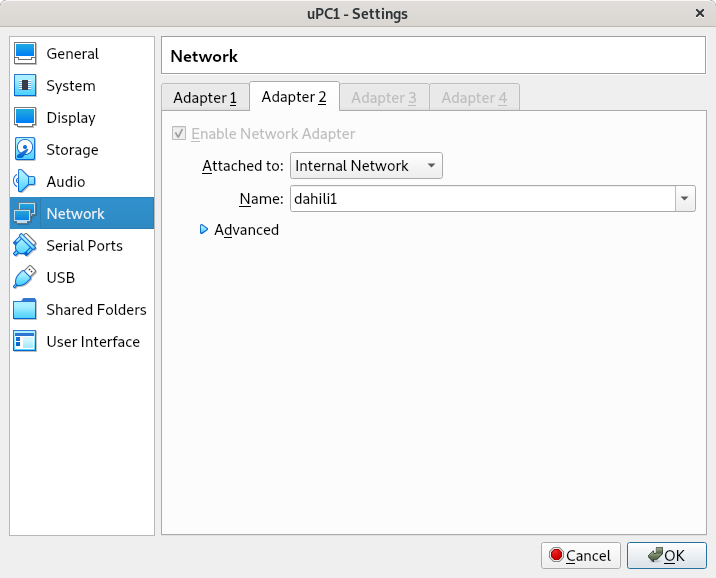
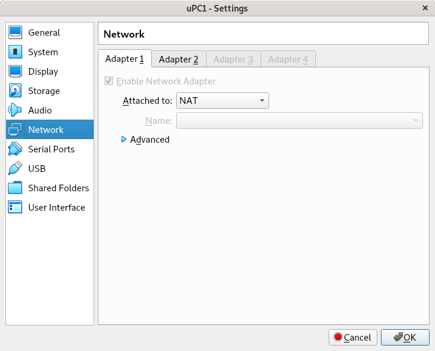
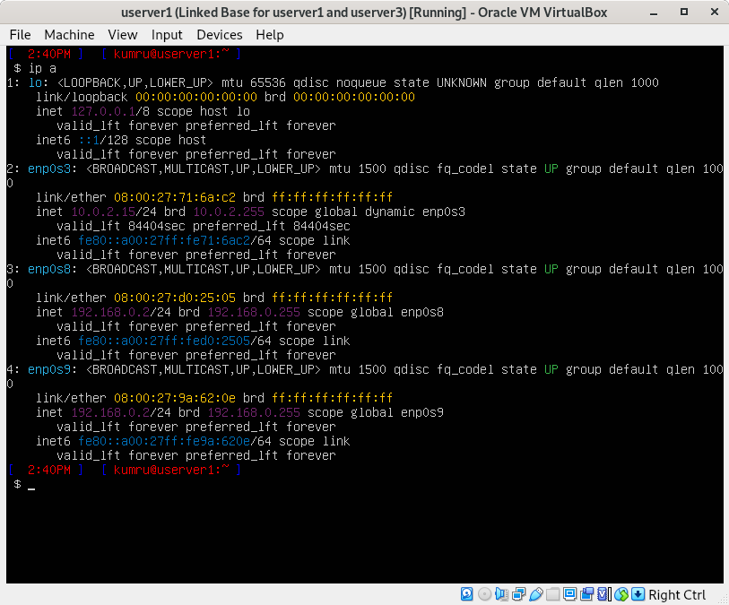
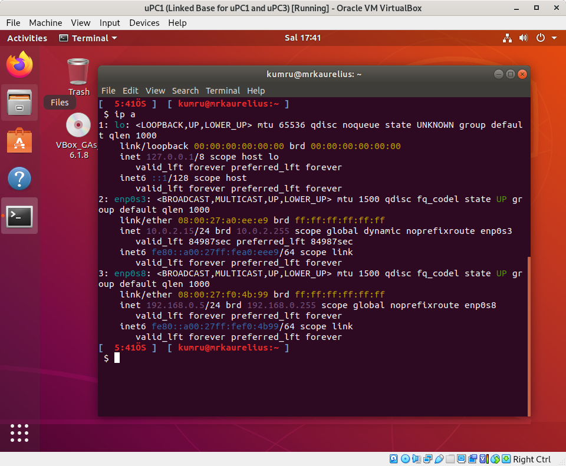
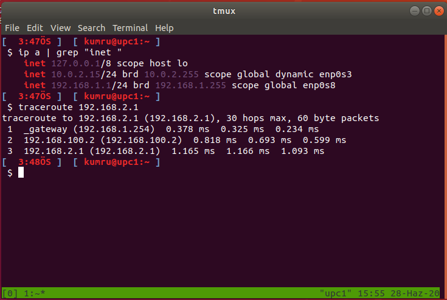
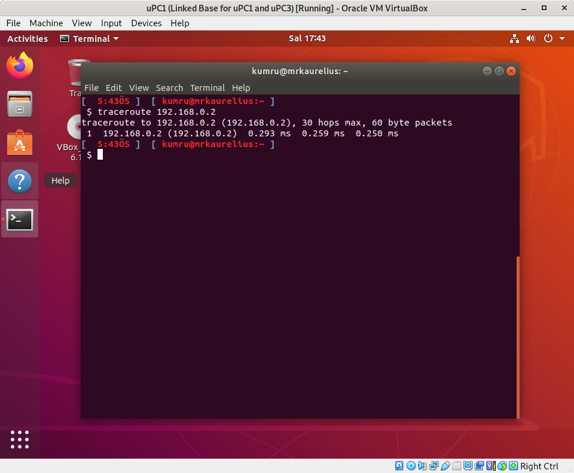
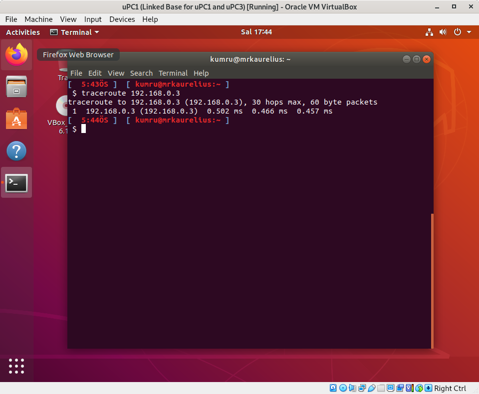

# Linux Ağ Yönetimi Final Projesi 
# Abdulhamit Kumru 170202020 

\pagebreak

### Makinelerin Klonlanması

Base olarak kullanacağımız makineyi oluşturduktan sonra klon makineyi menüden sağ tıklayıp istediğimiz 
şekilde oluşturabiliyoruz. Biz daha az yer kullanmak ve ortak networklere bağlanacağımız için `Linked Clone` 
ve `Generate new MAC addresses for all network adapters` seçeneğini kullanacağız.

{ height=250px }

{ height=250px }

Kullanılan yazılımların versiyonları `Ubuntu Desktop / Server 18`, `Virtual Box 6.1`

\pagebreak

## Senaryo 1

### NAT ile Host-Guest Ubuntu PC Bağlantısı 

Başlangıc olarak guest makinenin Network Adapterini NAT olarak seçiyoruz

{ height=250px }

##### SSH 

host makineye NAT bağlantı ile erişebilmek için öncelikle gerekli gerekli portu yönlendiriyoruz
daha sonra gueste ssh ile bağlanabilmek için open-ssh serveri apt ile yüklüyoruz.

{ height=250px }

```bash
$ apt install opessh-server
```

ssh server servisinin ayarlarını  dosyasından 22 numaralı portu ve parolayı kabul edicek
şekilde yapıyoruz.

```bash
$ echo "Port 22" >> /etc/ssh/sshd_config
$ echo "PasswordAuthentication yes" >> /etc/ssh/sshd_config
```

Ayarların aktif olmasi için ssh servisimizi yeniden başlatıyoruz.

```bash
$ sudo service ssh restart
```

Forward ettiğimiz port üzerinden guest'e bağlabiliriz.

```bash
$ ssh kumru@192.168.1.100 -p 22222 # hostun ip adresi
```

{ height=250px }

#### Ping

Eğer ICMP port ile çalışsaydı aynı şekilde onunda portunu yönlendirip gueste ping atabilirdik fakat ICMP
TCP/UDP portları üzerinden çalışmıyor.

{ height=250px }

#### Misafir Eklentileri 

Misafir eklentilerini guest makinye sanal disk takarak yükleyebiliyoruz bu sayade hosttan gueste veya guestten
hosta kopyala yapıştır ve dosya sürekle bırak yapabiliyoruz. Eklentiyi yüklelemek zor değil sanal makine
penceresinden `Devices > Insert Guest Additions CD...` seçeneğini seçince bize autorun.sh'ı çalıştırayım mı
diye soruyor evet diyip parolamızı girince eklentiler yükleniyor

{ height=250px }

Sanal makinenin penceresinden  `Devices > Drag and Drop`, `Devices > Shared Clipboard` seçeneklerinden detaylı
ayar yapılabilir.

{ height=250px }

### Network Bridge ile Host, TinyCore Guest Bağlantısı

Guestin network adapter ayarını Bridge Adapter olarak seçiyoruz

{ height=250px }

TinyCoreda IP'mizi ifconfig komutu ile kontol edebiliyoruz.

{ height=250px }

Network Bridge ile Guest LANdaki makine gibi kullanılabilir.

#### SSH

tce-load programı ile TinyCoreda program yükleyebiliyoruz.

```bash
# openssh client/server paketini yukleme
tce-load -w -i openssh.tcz
# ssh/sshd ayarlari
cp /usr/local/etc/ssh/ssh_config.orig /usr/local/etc/ssh/ssh_config
cp /usr/local/etc/ssh/sshd_config.orig /usr/local/etc/ssh/sshd_config
echo "Port 22" >> /usr/local/etc/ssh/sshd_config
echo "PasswordAuthentication yes" >> /usr/local/etc/ssh/sshd_config
# servisi calistirma
/usr/local/etc/init.d/openssh start
```

{ height=250px }

#### Ping

{ height=250px }

### Host only Adapter ile Host, Ubuntu Server Guest Bağlantısı

Host only Adapter kullanabilmek için öncelikle Host Network oluşturmak gerekli. Ana Menüden 
`File > Host Network Manager...`i seçip create tıklıyoruz ve Network Oluşuyor.

{ height=250px }

Guestimizin Network adapterini Host only Adapter seçip alt seçenekten oluşturduğumuz Host Network'ü seçiyoruz.

{ height=250px }

yaml fromatındaki `/etc/netplan/50-cloud-init.yaml` dosyasını Network Interfacemizi DHCP ile yönetilmesi için
ayarlıyoruz

```yaml
# /etc/netplan/50-cloud-init.yaml
network:
  version: 2
  renderer: networkd
  ethernets:
    enp0s9:
      dhcp4: yes
```

Yeni ayarların kullanması için netplan komutunu çalıştırıyoruz.

```bash
$ sudo netplan --debug apply
```

{ height=250px }

#### SSH

NAT ile Host, Guest Ubuntu PC Bağlantısı bölümünde yaptığımız komutları burada tekrar ediyoruz.

```bash
$ apt install opessh-server
$ echo "Port 22" >> /etc/ssh/sshd_config
$ echo "PasswordAuthentication yes" >> /etc/ssh/sshd_config
$ sudo service ssh restart
```

userver1'e SSH ile bağlanıyoruz.

```bash
$ ssh kumru@192.168.56.101
```

{ height=250px }

#### Ping

{ height=250px }

\pagebreak

## Senaryo 2

#### Internal Network ile Host-Guest, Guest-Guest Bağlatısı

#### Internal Network Ayarı

Senaryo geregi ip Ubuntu Serverlarin ipleri 

`host: 192.168.0.1
userver1: 192.168.0.2
userver2: 192.168.0.3
userver3: 192.168.0.4`

Internal network için Network Adapterin modunu seçmek yeterli.

{ height=250px }

#### Netplan Ayarları

netplan ayarlarını Senaryo 1 de yaptığımız gibi yapıyoruz. Farklı olarak dhcp olmadan statik bir şekilde IP 
alıyoruz

```yaml
# /etc/netplan/50-cloud-init.yaml
# S:0 R:2
network:
  version: 2
  renderer: networkd
  ethernets:
    enp0s8:
      dhcp4: no
      addresses:
        - 192.168.0.2/24 # userver1 için
      gateway4: 192.168.0.1
      nameservers:
          # aslinda nameserver ayarlamanın anlamı yok ama adet yerini bulsun
          addresses: [8.8.8.8, 1.1.1.1]
```

#### SSH

SSH server yüklediğimiz için ve diğer makineler klon olduğu için bir daha SSH yükleme ve ayarlamaya gerek yok.
Guestler arasında SSH bağlantısı yapılabiliyor.

{ height=250px }

{ height=250px }

Internal Networkte hostdan guestlere ulaşmak mümkün değil.

{ height=250px }

#### Ping

Guestler birbirlerine ulaşabildiği için birbirlerine ping göndermeleri mümkün.

{ height=250px }

#### SCP

Gerek olmasada boş dosya göndermek yerine sıfır yazılmış 100M büyüklüğünde dosyalar gönderelim.

```bash
# dosyalari hazirlama
$ dd if=/dev/zero of=abdulhamit.txt count=100 bs=1M
$ cat abdulhamit.txt > kumru.txt > 170202020.txt
# scp komutu
$ scp *.txt 192.168.0.3:/home/kumru/
```

{ height=250px }

\pagebreak

## Senaryo 3

### Network Ayarları

#### Virtual Box Ayarları

{ height=250px }

{ height=250px }

#### Network Şeması

dahili1  
`uPC1 NAT dhcp, dahili1 192.168.0.5`  
`userver2 NAT dhcp, dahili1 192.168.0.3`
  
dahili2  
` uPC2 NAT, dahili2 192.168.0.6`  
`userver1 NAT, dahili2 192.168.0.2`

\pagebreak

#### Netplan Ayarları

Ubuntu Server için netplan ayarı 

Internal Network için `50-cloud-init.yaml` dosyasını kullandık.

```yaml
# /etc/netplan/50-cloud-init.yaml
network:
  version: 2
  renderer: networkd
  ethernets:
    enp0s8:
      dhcp4: no
      addresses:
        - 192.168.0.2/24 
      #gateway4: 192.168.0.1
      nameservers:
          # aslinda nameserver ayarlamanın anlamı yok ama adet yerini bulsun
          addresses: [8.8.8.8, 1.1.1.1]
```

NAT için yüklemede oluşturulan `00-installer-config.yaml`  dosyasını kullandık.

```yaml
# /etc/netplan/00-installer-config.yaml
network:
  ethernets:
    enp0s3:
      dhcp4: yes
    version: 2
```

Ubuntu Desktop için netplan ayarı.

```yaml
# /etc/netplan/01-network-manager-all.yaml
# Let NetworkManager manage all devices on this system
network:
  version: 2
  renderer: NetworkManager
  ethernets: 
    enp0s3:
      dhcp4: yes
    enp0s8:
      dhcp4: no
      addresses:
        - 192.168.0.5/24
          #gateway4: 192.168.0.1
      nameservers:
          addresses: [8.8.8.8, 1.1.1.1]
```

Yapılan ayarları uygulama.

```bash
$ sudo netplan --debug apply
```

{ height=250px }

{ height=250px }

#### traceroute

Traceroute komutu ile paketlerin izlediği yolun takibini yapabiliriz.

{ height=250px }

{ height=250px }

{ height=250px }
